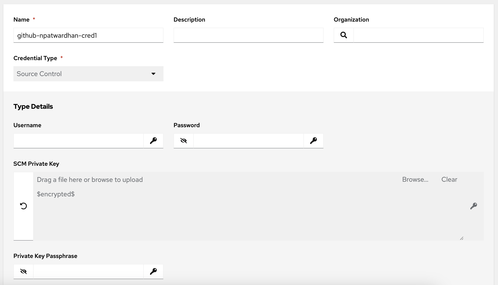
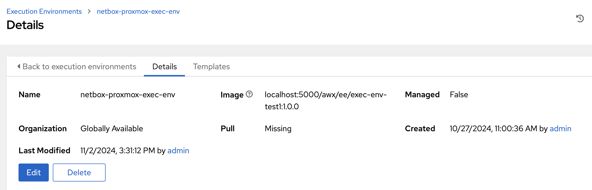
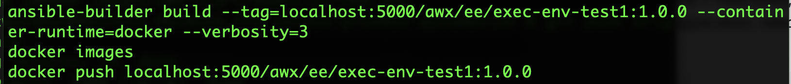
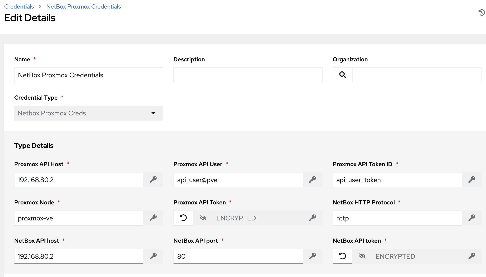
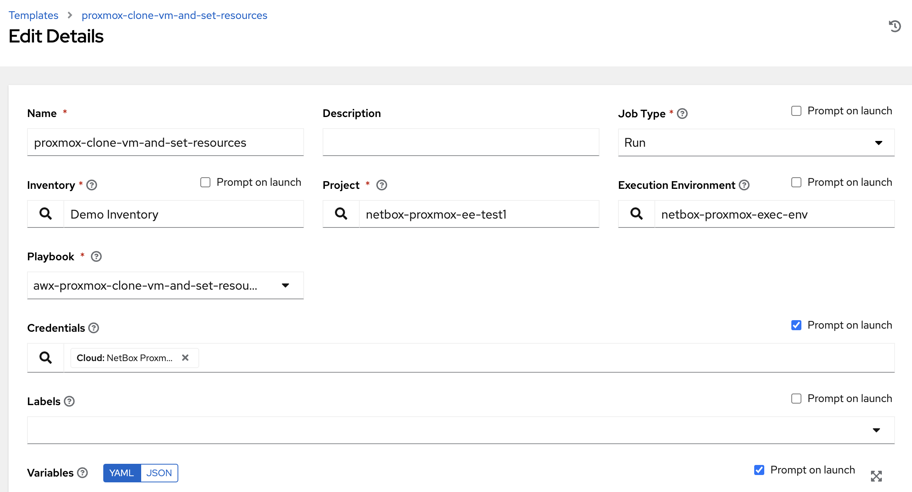

# Configure AWX/Tower/AAP

*You only need to do this configuration step if you intend to use AWX/Tower/AAP to handle your Proxmox automation.*

Certainly, you do not need to do Ansible automation by using webhooks and event rules (triggering) in NetBox.  [This weblog](https://netboxlabs.com/blog/getting-started-with-network-automation-netbox-ansible/) shows you how you can use [Ansible](https://www.ansible.com/) with NetBox, as network source of truth, to induce changes in your environment -- by facilitating automation from any client on your network.  In that example, you'd be able to run `ansible-playbook`, alongside a dynamic inventory (NetBox) to induce automation, and from there you could add Proxmox VM automation.

However, many other NetBox users want to use NetBox as NSoT (network source of truth) to facilitate their Proxmox VM automation.  Changes to (Proxmox) VMs in NetBox will result in automation being kicked off, in this case via [AWX](https://github.com/ansible/awx), or perhaps for a Red Hat commercial customer, through [Tower/AAP](https://www.redhat.com/en/solutions/it-automation?sc_cid=7015Y000003sm3kQAA&gad_source=1&gclid=CjwKCAiAl4a6BhBqEiwAqvrqugh1f-1RfeP-NQxOKYhSbwJqUPVqGqR1A0ScrGMdNhLUbdTayU-EOhoCg00QAvD_BwE&gclsrc=aw.ds).  By using webhooks and event rules in NetBox, AWX/Tower/AAP are more than capable of inducing Proxmox automation.  In fact, using AWX/Tower/AAP is the preferred method for large environments -- where Proxmox VM deployment might be a part of an underlying CI/CD process.

For those who are unfamiliar, AWX is the upstream (community, i.e. free) version of AAP.  Functionally, AWX works the same way as Tower/AAP, but without the commercial support.  AWX is an excellent alternative as you work through NetBox/Proxmox automation, but it can be a heavy lift when configuring AWX for the first time.  This section talks through the steps you'll need to be able to run AWX and to begin your Proxmox VM automation journey with NetBox.

### Installing AWX with docker-compose

AWX/Tower/AAP are typically installed in an environment where Kuberenetes (k8s) is available.  However, should you have Docker/docker-compose running on your local system, you should be able to install AWX [this way](https://github.com/ansible/awx/blob/devel/tools/docker-compose/README.md).

Once you have installed AWX/Tower/AAP in your environment, and are able to login, as an 'admin' user through the UI, you can start configuring AWX/Tower/AAP to facilitate your Proxmox VM automation.  *Note that you can add whatever user(s)/group(s) that you want to AWX, but make sure that whatever user(s)/group(s) you add to AWX have the appropriate permissions to manage the following.*

#### Create Github (or your Git of choice) Credential in AWX

1. Login to the AWX UI
2. Navigate to Resources > Credentials
3. Create a new credential, as specified below, of type 'Source Control'.  Call it whatever you want, then make sure to copy and paste your SSH private key and (if required) SSH passphrase here.



#### Select Inventory in AWX

Navigate to Resources > Inventories.  'Demo Inventory' should be sufficient for `netbox-promox-automation`.


#### Create Execution Environment in AWX

Typically, when `ansible` or `ansible-playbook` is/are executed from the command line, this is done via a Python3 `venv`.  However, with AWX, there is no such capability to interact with a command line to leverage `venv` to do a `pip install` of NetBox/Python module dependencies.

As a result, you will need to use an [Execution Environment](https://ansible.readthedocs.io/projects/awx/en/latest/userguide/execution_environments.html) in AWX.  Your Execution Environment is a container image that will include all of the (NetBox/Python) module dependencies that you'll need to facilitate Proxmox automation, and this container image will live in your container registry of choice.  

*You (probably) only need to create an Exection Environment once for `netbox-proxmox-automation` with AWX/Tower/AAP.*

In the end, your Execution Environment should look like this in AWX.



To create your Execution Environment, you need to do the following.

1. On your AWX host, create a directory structure like this.


2. On your AWX host, create and change to the directory where your Execution Environment will live: `mkdir -p /home/ubuntu/awx/execution-environments/ubuntu-env1; cd /home/ubuntu/awx/execution-environments/ubuntu-env1`

3. On your AWX host, setup a Python 3 `venv`: `cd /home/ubuntu/awx/execution-environments/ubuntu-env1 ; python3 -m venv venv ; source venv/bin/activate`

4. On your AWX host, create a file called `execution-environment.yml`.  It should look like the following.


Note that `execution-environment.yml` contains two requirement lines.  One is for Ansible Galaxy, and the other is for Python 3.

5. Create `dependencies/requirements.txt` and `dependencies/requirements.yml`.

`requirements.txt` will include the Python 3 module dependencies.

```
(venv) shell$ mkdir dependencies

(venv) shell$ cat dependencies/requirements.txt
ansible
ansible-core
ansible-runner
bcrypt
certifi
cffi
charset-normalizer
cryptography
dnspython
docutils
idna
Jinja2
lockfile
MarkupSafe
packaging
paramiko
pexpect
prompt-toolkit
proxmoxer
ptyprocess
pycparser
PyNaCl
pynetbox
python-daemon
PyYAML
questionary
requests
resolvelib
six
urllib3
wcwidth
```

`requirements.yml` will define the Ansible collections to include.  In this case we want to include the awx collection, the community.general collection (where the Proxmox Ansible modules live), and the netbox.netbox collection, which will interface with the NetBox API.

```
(venv) shell$ mkdir dependencies

(venv) shell$ cat dependencies/requirements.yml
---
collections:
  - awx.awx
  - community.general
  - netbox.netbox
```

6. Finally, build the new Execution Environment image, and push to your container registry, which in this case lives on localhost (local to AWX)



Once you have built your Execution Environment, which is based on the default AWX Execution Environment, you can proceed with Proxmox automation in AWX.

#### Add NetBox and Proxmox Credential Types to AWX

Navigate to Administration > Credential Types in AWX, and create a credential type called 'NetBox Proxmox Creds'.


Input configuration should include the following:

```
fields:
  - id: proxmox_api_host
    type: string
    label: Proxmox API Host
  - id: proxmox_api_user
    type: string
    label: Proxmox API User
  - id: proxmox_api_user_token
    type: string
    label: Proxmox API Token ID
  - id: proxmox_node
    type: string
    label: Proxmox Node
  - id: proxmox_api_token_secret
    type: string
    label: Proxmox API Token
    secret: true
  - id: netbox_api_proto
    type: string
    label: NetBox HTTP Protocol
  - id: netbox_api_host
    type: string
    label: NetBox API host
  - id: netbox_api_port
    type: string
    label: NetBox API port
  - id: netbox_api_token
    type: string
    label: NetBox API token
    secret: true
required:
  - proxmox_api_host
  - proxmox_api_user
  - proxmox_api_user_token
  - proxmox_node
  - proxmox_api_token_secret
  - netbox_api_host
  - netbox_api_port
  - netbox_api_proto
  - netbox_api_token
```

Injector configuration should include the following (yes, `extra_vars` is required, as is `netbox_env_info` and `proxmox_env_info`):

```
extra_vars:
  netbox_env_info:
    api_host: '{{ netbox_api_host }}'
    api_port: '{{ netbox_api_port }}'
    api_proto: '{{ netbox_api_proto }}'
    api_token: '{{ netbox_api_token }}'
  proxmox_env_info:
    node: '{{ proxmox_node }}'
    api_host: '{{ proxmox_api_host }}'
    api_user: '{{ proxmox_api_user }}'
    api_token_id: '{{ proxmox_api_user_token }}'
    api_token_secret: '{{ proxmox_api_token_secret }}'
```

#### Add NetBox/Proxmox Credentials to AWX

Navigate to Resources > Credentials in AWX, and create a credential called 'NetBox Proxmox Credentials'.



#### Add Project to AWX

Navigate to Resources > Projects in AWX, and create a new Project called 'netbox-proxmox-ee-test1'.


Click the 'Sync' button in the AWX UI to ensure that git synchronization is successful.  If this step is *not* successful, then *do not proceed* -- as you troubleshoot.  Otherwise, proceed.

#### Add (job) Templates to AWX

In AWX, a (job) template provides a web accessible means of triggering automation, i.e. via a webhook.  Each (job) template represents an Ansible playbook -- each Ansible playbook represents a file that was synchronized from git when you created the project in AWX -- where the playbook will perform Proxmox automation.

For example, when you have defined a Proxmox VM in NetBox (alongside its default resources), you can use `awx-clone-vm-and-set-resources.yml` to automate the cloning of a VM and setting its resources in Proxmox.


When you create *any* template in AWX for Proxmox automation, you will need to set 'Prompt on launch' to true (tick checkbox) for both 'Credentials' and 'Variables', as shown below.



`netbox-proxmox-ansible` provides a series of Ansible playbooks that you can use to create fully-functioning Proxmox VMs based on their desired configuration states in NetBox.  You will need to create a (job) template for each playbook in AWX.

`netbox-proxmox-automation` implements the following Ansible playbooks.

| Ansible playbook | Purpose |
| --- | --- |
| awx-proxmox-add-vm-disk.yml | Adds a disk to Proxmox VM (*not* scsi0, which is the OS disk) |
| awx-proxmox-clone-vm-and-set-resources.yml | Clones a Proxmox VM template to a Proxmox VM and sets resources like vcpu and memory |
| awx-proxmox-remove-vm-disk.yml | Removes a non-OS disk (i.e. not scsi0) from a Proxmox VM |
| awx-proxmox-remove-vm.yml | Removes a Proxmox VM |
| awx-proxmox-resize-vm-disk.yml | Resizes a Proxmox VM disk |
| awx-proxmox-set-ipconfig0.yml | Sets ipconfig0 for Proxmox VM and adds ssh key|
| awx-proxmox-start-vm.yml | Starts Proxmox VM |
| awx-proxmox-stop-vm.yml | Stops Proxmox VM |

