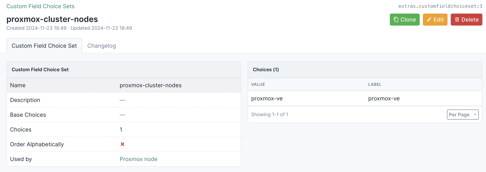
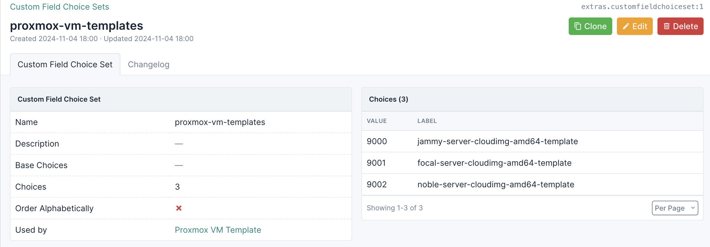
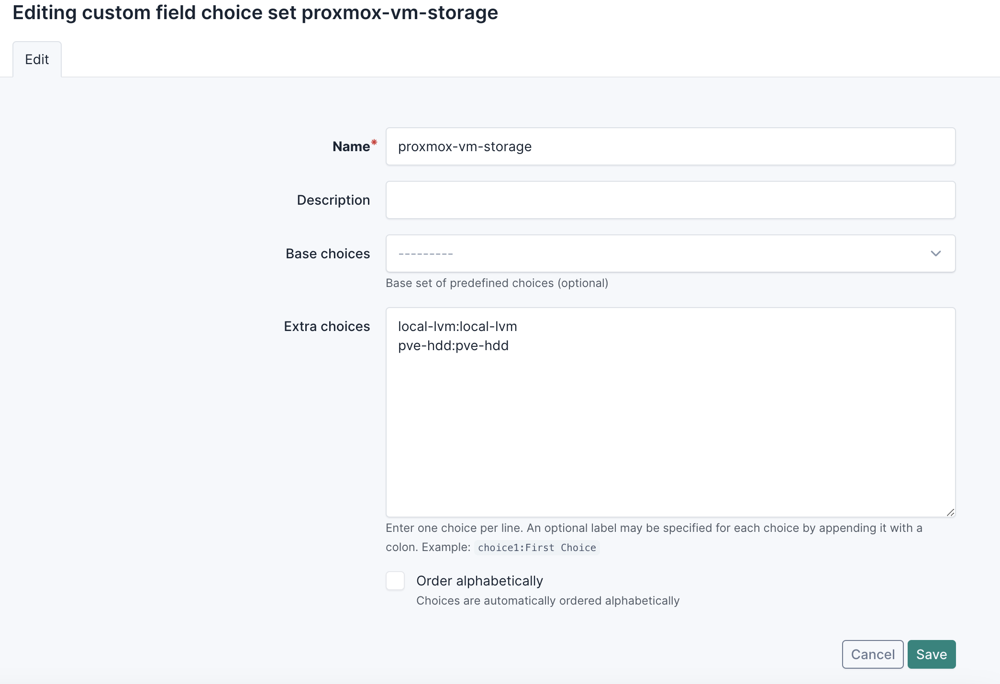
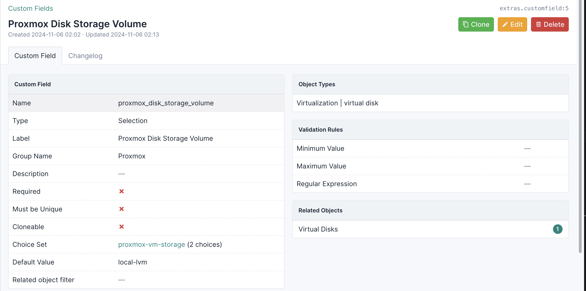
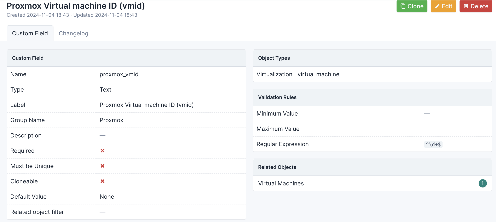

# NetBox Customization

You will need to do some customization to NetBox to define the underlying Proxmox VM configuration(s).  This section covers the custom field choices and custom fields that you'll need to create in NetBox -- in order for you to facilitate automation.

### Custom Field Choices (for Proxmox VM templates and storage)

In the NetBox UI, you will need to create the following custom field choices

1. `proxmox-node` will be used to correlate a Proxmox node to the Proxmox VM that you will provision
2. `proxmox-vm-templates` will be used to correlate a Proxmox VM template with the Proxmox VM that you will provision
3. `proxmox-vm-storage` will be used to correlate an underlying Proxmox VM storage volume with the Proxmox VM you will provision

In the NetBox UI, navigate to Customization > Custom Field Choices

#### proxmox-node

Create custom field choices for Proxmox VM Node(s).  When you click the '+' button, you will be presented with an Edit screen.  Fill the form as shown below.  Note that your choices will represent a list of Proxmox cluster nodes.  You will need to login to the Proxmox UI to get the list of Proxmox cluster nodes.

When you are done, your Custom Field Choices for Proxmox VM node(s) should look like this.

#### proxmox-vm-templates

Create custom field choices for Proxmox VM Templates.  When you click the '+' button, you will be presented with an Edit screen.  Fill the form as shown below.  Note that your choices will have a (Proxmox) VMID to name-of-template mapping.  You will need to login to the Proxmox UI to get the VMID to name-of-template mappings.

When you are done, your Custom Field Choices for Proxmox VM templates should look like this.

#### proxmox-vm-storage

Create custom field choices for Proxmox VM Storage.  When you click the '+' button, you will be presented with an Edit screen.  Fill the form as shown below.  Note that your choices will represent the name/value of each Proxmox storage volume.  You will need to login to the Proxmox UI to get a list of Proxmox storage volumes.

When you are done, your Custom Field Choices for Proxmox VM storage should look like this.

### NetBox Customization: Custom Fields (for Proxmox VMs)

In the NetBox UI, you will need to create a series of custom fields, as noted below.

1. `proxmox_node` will be used to correlate a Proxmox cluster node with the Proxmox VM that you want to create
2. `proxmox_vm_template` will be used to correlate a Proxmox VM template with the Proxmox VM that you want to create
3. `proxmox_vm_storage` will be used to correlate a Proxmox VM storage volume with the Proxmox VM that you want to create
4. `proxmox_disk_storage_volume` will be used to correlate a Proxmox VM storage volume with each Proxmox VM disk that you want to create
5. `proxmox_public_ssh_key` will be used to assign a public SSH key that you will use to login to a Proxmox VM
6. `proxmox_vmid` will be used to document the Proxmox `vmid` that was created when the Proxmox VM was created

In the NetBox UI, navigate to Customization > Custom Fields

#### proxmox_node

Create a custom field for Proxmox Node.  It will be called `proxmox_node`.  Here is what `proxmox_node` should look like after you've made your changes.

#### proxmox_vm_template

Create a custom field for Proxmox VM template.  It will be called `proxmox_vm_template`.  Here is what `proxmox_vm_template` should look like after you've made your changes.

#### proxmox_vm_storage

Create a custom field for Proxmox VM storage.  It will be called `proxmox_vm_storage`.  Here is what `proxmox_vm_storage` should look like after you've made your changes.

#### proxmox_disk_storage_volume

Create a custom field for Proxmox disk storage volume.  It will be called `proxmox_disk_storage_volume`.  Here is what `proxmox_disk_storage_volume` should look like after you've made your changes.

#### proxmox_public_ssh_key

Create a custom field for Proxmox VM public SSH key.  It will be called `proxmox_public_ssh_key`.  Here is what `proxmox_public_ssh_key` should look like after you've made your changes.

#### proxmox_vmid

Create a custom field for Proxmox VMID.  It will be called `proxmox_vmid`.  Here is what `proxmox_vmid` should look like after you've made your changes.  *Note that `proxmox_vmid` is set automatically during the Proxmox VM provisioning process.  Any VMID that you specified will be discarded.*

