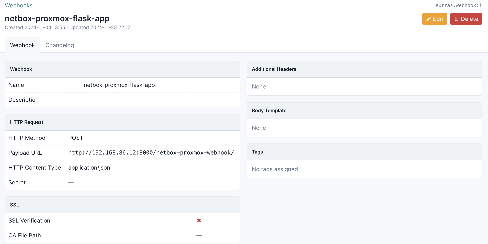
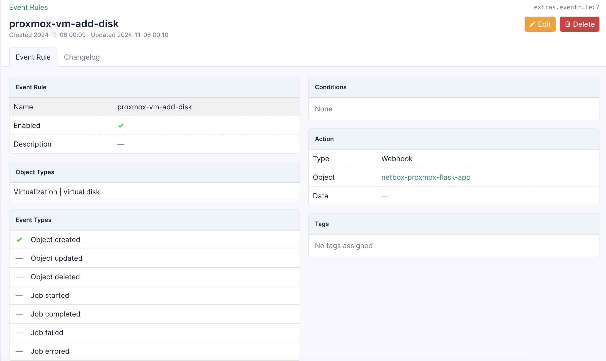
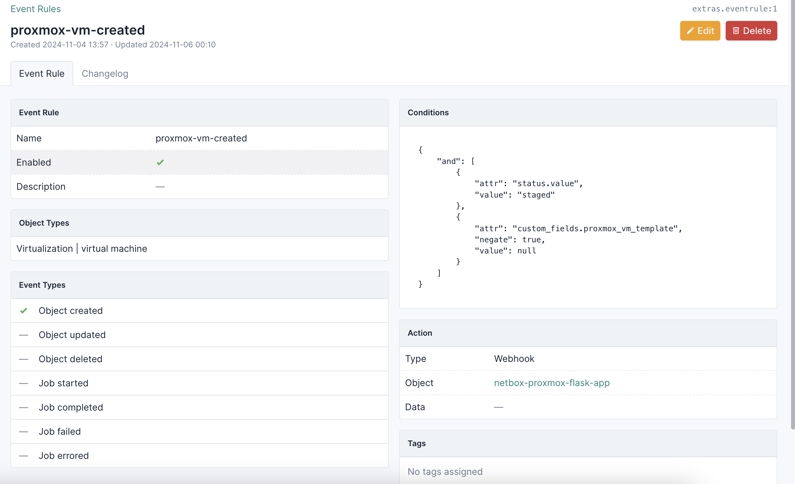
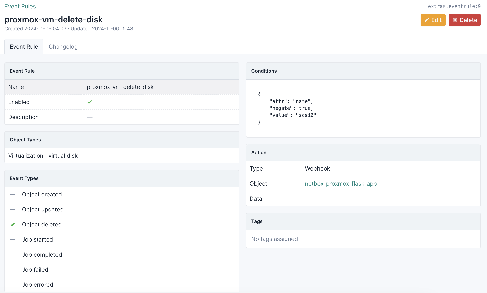
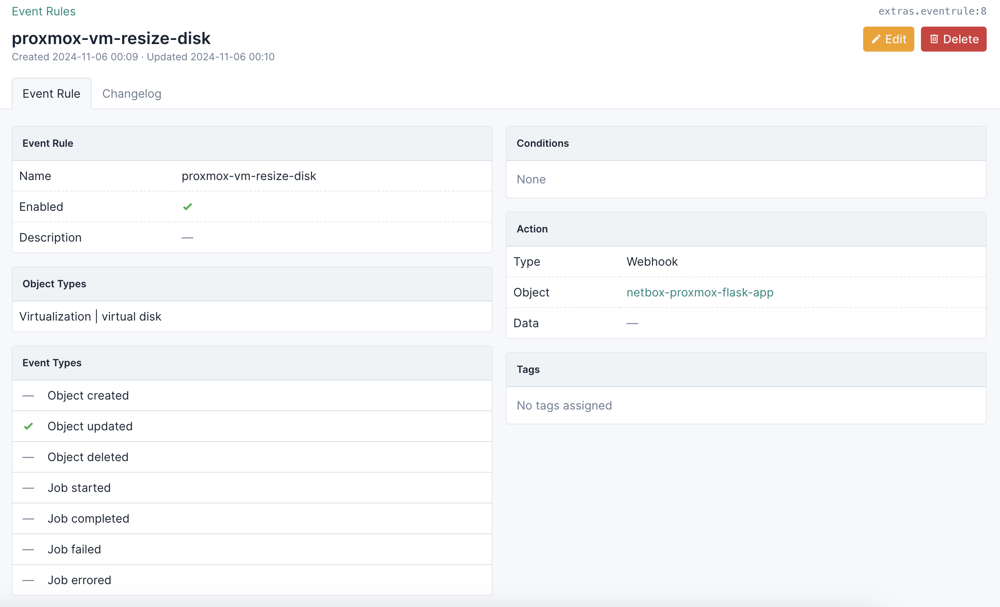
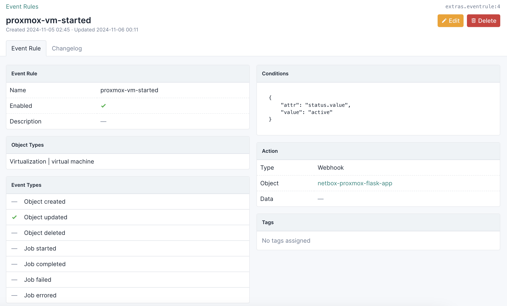
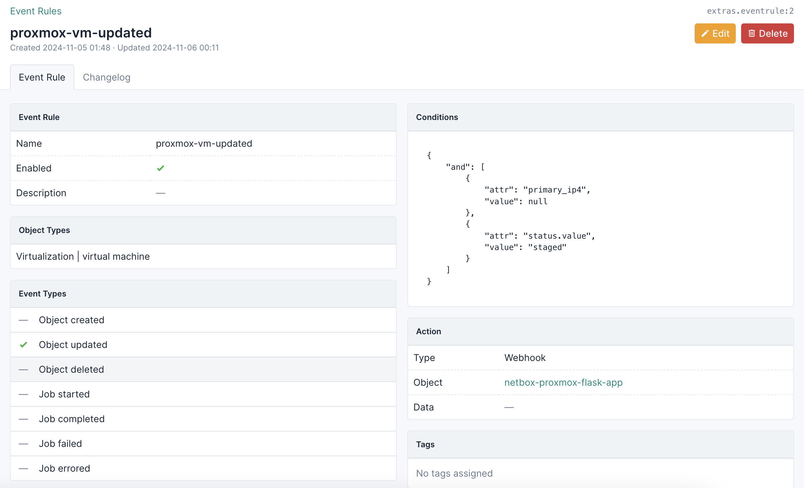

# Initial Configuration: NetBox Event Rules and Webhooks (Flask application)

There are two key components to automating Proxmox VM management in NetBox.

1. webhooks
2. event rules

A webhook in NetBox will consume the payload of data from an event rule.  An event rule announces changes to an object type inside of NetBox (in this case, a Virtual Machine and its related object types) -- then sends the payload of data around those changes to a webhook.  The webhook will handle the Proxmox automation(s) as you've defined it/them.

For the sake of automation, every event rule that you create in NetBox requires either a Webhook or a Script.

Regardless of whether you are using a Flask (or other) application for Proxmox automation, or you are using AWX/Tower/AAP, this automation should trigger anytime that a Proxmox VM is changed in NetBox such that:

- a Proxmox VM has been created in NetBox with a status of 'Staged'
- a Proxmox VM in NetBox (with a status of 'Staged') has a changed network configuration
- a Proxmox VM in NetBox (with a status of 'Staged') adds new disks
- a Proxmox VM in NetBox (with a status of 'Staged') has a changed disk configuration
- a Proxmox VM in NetBox has been set to a status of 'Active'
- a Proxmox VM in NetBox has been set to a status of 'Offline'
- a Proxmox VM in NetBox has been removed


### Flask Application

As noted [here](#initial-configuration-flask-application-python), you will need to have a running Flask application *before* you can start handling events (i.e. object changes) inside of NetBox.

#### Automated Webhook and Event Rules Configuration

If you'd prefer to manually create the webhook and event rules in NetBox, you can skip to the next section.  Otherwise, proceed with the following to automate the creation of the webhook and event rules in NetBox.

`netbox-proxmox-automation` version 1.1.0 and newer ships with a convenience script, `netbox_setup_webhook_and_event_rules.py`, that when used alongside a configuration file of your choice, will greatly simplify this process.

There exists a sample configuration file called `netbox_setup_objects.yml-sample` under the conf.d directory of this git repository.  Copy this file to a location of your choice, and season it to taste.  In the end you should have a configuration that looks something like this.

```
proxmox_api_config:
  api_host: proxmox-ip-or-hostname
  api_port: 8006
  api_user: proxmox_api_user
  api_token_id: name_of_proxmox_api_token
  api_token_secret: proxmox_api_secret_token
  verify_ssl: false
netbox_api_config:
  api_proto: http # or https
  api_host: name or ip of NetBox host
  api_port: 8000
  api_token: netbox_api_secret_token
  verify_ssl: false # or true, up to you
proxmox:
  cluster_name: proxmox-ve
netbox:
  cluster_role: Proxmox
  vm_role: "Proxmox VM"
automation_type: flask_application
flask_application:
  host: name or ip of where Flask application is running
  http_proto: http or https
  http_port: 9000 or whatever
  ssl_verify: false # or true
  netbox_webhook_name: "netbox-proxmox-webhook"
```

Usage:

```
shell$ cd setup

shell$ pwd
/some/path/netbox-proxmox-automation/setup

shell$ python3 -m venv venv

shell$ source venv/bin/activate

(venv) shell$ pip install -r requirements.txt

(venv) shell$ ./netbox_setup_webhook_and_event_rules.py --config /path/to/your/configuration.yml
```

Then verify that everything has been created.  You can skip the rest of this document if so.

#### Flask Application: Webhook

`example-netbox-webhook-flask-app` implements a catch-all for virtual machine events that happen in NetBox.  Events will call the webhook, and in turn the webhook will dispatch Proxmox VM changes via the Proxmox API.

You need to create the webhook, in NetBox, first.  Navigate over to Operations > Integrations > Webhooks, and add something like the following.  *This, and the IP address of where you are running the Flask application, needs to match what you defined `netbox_webhook_name` in `app_config.yml`.*

```
(venv) shell$ grep netbox_webhook_name app_config.yml
netbox_webhook_name: "netbox-proxmox-webhook"
```

In this case, our URI will be `netbox-proxmox-webhook` (the trailing slash is critical!), and our webhook will be listening on the public interface and port that were specified when we started our Flask application.  When you add the webhook to NetBox (use the '+' button), it should look something like this.



#### Flask Application: Event Rules

You will need to add the following event rules to NetBox to update Proxmox when virtual machines have been created, updated, and/or deleted.
1. `proxmox-vm-add-disk` takes a Proxmox virtual machine disk that was added to NetBox then automates disk addition in Proxmox



2. `proxmox-vm-created` takes a Proxmox virtual machine that was created in NetBox then automates Proxmox VM cloning; the Proxmox VM in NetBox status should be set to 'Staged', and the selected Proxmox VM template cannot be null



3. `proxmox-vm-delete-disk` takes a Proxmox virtual machine disk that was removed from NetBox then removes the non-OS disk from Proxmox; this *does not* include `scsi0`, which is the OS disk that's been provisioned in Proxmox



4. `proxmox-vm-deleted` takes a Proxmox virtual machine that was deleted from NetBox then stops/removes the VM from Proxmox


5. `proxmox-vm-resize-disk` takes a Proxmox virtual machine disk that was changed in NetBox then resizes the disk in Proxmox (*cannot downsize a disk, by design*); this can be used for *any* Proxmox VM disk



6. `proxmox-vm-started` takes a Proxmox virtual machine whose state was changed to 'Active' in NetBox and starts the VM in Proxmox



7. `proxmox-vm-stopped` takes a Proxmox virtual machine whose state was changed to 'Offline' in NetBox and stops the VM in Proxmox


8. `proxmox-vm-update-network-config` takes a Proxmox virtual machine whose network configuration was changed in NetBox (IP address, SSH public key), with the NetBox status set to 'Staged', and adds those network configuration settings to Proxmox


9. `proxmox-vm-updated` takes any Proxmox virtual machine updates (vcpus, memory, etc) in NetBox, where the Proxmox VM status is set to 'Staged', and changes those settings in Proxmox



